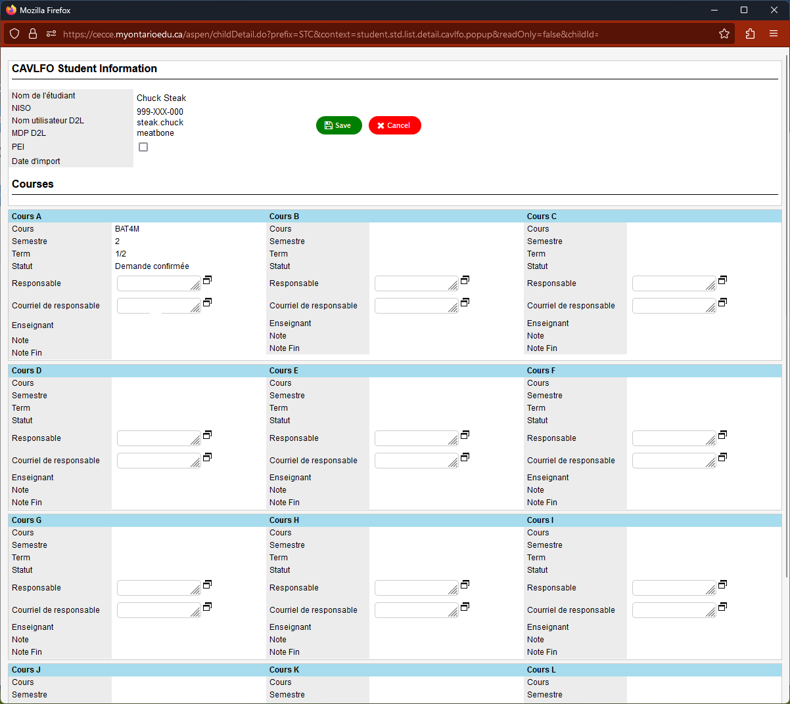
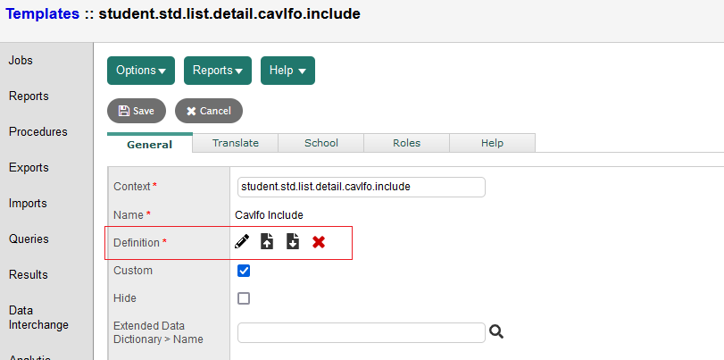

# Formulaires CAVLFO

Interface plus conviviale pour la saisie de données des 
Personnes Responsables de l'Encadrement Local (PREL)

[Conseil / École] - > [Élève] -> [Onglet CAVLFO] -> formulaire

Les boutons "Sauvegarde" et "Cancel" étants complètememnt au bas du formulaire, plusieurs 
personnes ne sauvegardaient pas leur travail, faussant beaucoup 
de données.

Cette interface arrange les éléments de la page horizontalement, en rangées et présente les boutons au haut du formulaire avec couleurs vives.

## Setup

[Conseil] -> [Tools] -> [Templates]

Recherchez :

- student.std.list.detail.cavlfo.popup
- student.std.list.detail.cavlfo.include

## Mettez à jour le code pour les 2 gabarits
### Interface

### Modifier

